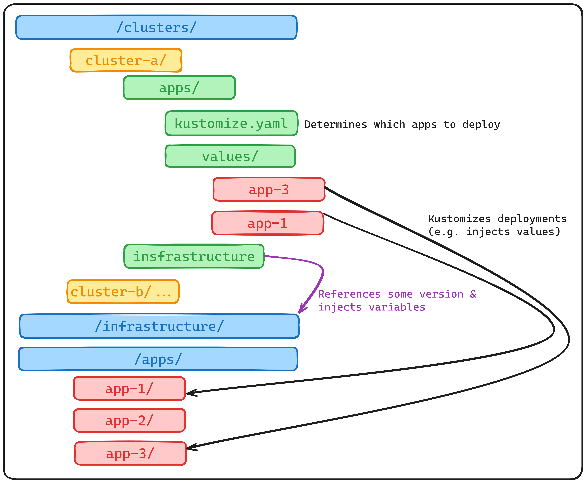

# Flux Demo

<!--toc:start-->
- [Flux Demo](#flux-demo)
  - [Setup](#setup)
    - [Generate a GitHub PAT](#generate-a-github-pat)
    - [Setup a Cluster with Flux](#setup-a-cluster-with-flux)
  - [Structure of the Repo](#structure-of-the-repo)
    - [Cluster Definitions](#cluster-definitions)
    - [Infrastructure Definition](#infrastructure-definition)
    - [Application Definitions](#application-definitions)
  - [Application vs Infrastructure](#application-vs-infrastructure)
  - [Workflow](#workflow)
    - [Deploying a new Application](#deploying-a-new-application)
    - [Testing new Infrastructure](#testing-new-infrastructure)
    - [Rolling out new Infrastructure](#rolling-out-new-infrastructure)
    - [Rolling back Infrastructure](#rolling-back-infrastructure)
    - [Onboarding a new Cluster](#onboarding-a-new-cluster)
<!--toc:end-->

---

This repository shows an example how one can use a single mono-repository to manage multiple
clusters' infrastructure in a controlled fashion.

## Setup

### Generate a GitHub PAT

See the documentation: https://docs.github.com/en/authentication/keeping-your-account-and-data-secure/managing-your-personal-access-tokens

For fined-grained control, grant the token Admin and content read/write permissions on the
repository.

### Setup a Cluster with Flux

Setup the required tooling with `devbox shell`, then

```bash
# install a cluster
kind create cluster -n demo
# set the token
export GITHUB_TOKEN='<redacted>'
# onboard flux
flux bootstrap github \
  --token-auth \
  --owner=f4z3r \
  --repository=flux-demo \
  --branch=main \
  --path=clusters/demo \
  --personal
```

<details>
<summary>Sample output from Flux installation</summary>

```
► connecting to github.com
► cloning branch "main" from Git repository "https://github.com/f4z3r/flux-demo.git"
✔ cloned repository
► generating component manifests
✔ generated component manifests
✔ committed component manifests to "main" ("158753158f3c760f741f22ed7f68bdee1b66e475")
► pushing component manifests to "https://github.com/f4z3r/flux-demo.git"
► installing components in "flux-system" namespace
✔ installed components
✔ reconciled components
► determining if source secret "flux-system/flux-system" exists
► generating source secret
► applying source secret "flux-system/flux-system"
✔ reconciled source secret
► generating sync manifests
✔ generated sync manifests
✔ committed sync manifests to "main" ("f7a731c9e05b983c33012805a6be60b30d34505e")
► pushing sync manifests to "https://github.com/f4z3r/flux-demo.git"
► applying sync manifests
✔ reconciled sync configuration
◎ waiting for GitRepository "flux-system/flux-system" to be reconciled
✔ GitRepository reconciled successfully
◎ waiting for Kustomization "flux-system/flux-system" to be reconciled
✔ Kustomization reconciled successfully
► confirming components are healthy
✔ helm-controller: deployment ready
✔ kustomize-controller: deployment ready
✔ notification-controller: deployment ready
✔ source-controller: deployment ready
✔ all components are healthy
```

</details>

## Structure of the Repo

The repository is structured in three distinct parts:

- The cluster definitions
- The infrastructure definition
- The application definitions

A general overview of the structure can be seen in the diagram below. Each element is explained in
later sections.



### Cluster Definitions

The cluster definitions are located under `./clusters/` and typically consist of two parts. A file
defining how the infrastructure should be deployed, and a part that defines what applications need
to be deployed.

The infrastructure part is essentially a back-reference to the same repository and a templating of
the infrastructure for the cluster. The back-reference is needed in order to be able to freeze the
infrastructure to a specific version. This is needed as it is typically needed to ship the
infrastructure as a whole, and not individual controllers. Using the back-reference the "state of
the infrastructure" can be versioned, and deployed individually to clusters. The templating is of
course needed to inject cluster dependent variables into the infrastructure definition.

See [`./clusters/demo/infrastructure.yaml`](./clusters/demo/infrastructure.yaml) for an example
infrastructure deployment.

<details>
<summary>Back-Reference</summary>

The back reference is achieved using a `GitRepository` that defines the mono-repo:

```yaml
apiVersion: source.toolkit.fluxcd.io/v1
kind: GitRepository
metadata:
  name: infrastructure
  namespace: flux-system
spec:
  interval: 1m
  url: https://github.com/f4z3r/flux-demo.git
  ref:
    tag: v0.1.0
```

The idea here is to allow to pin the version of the infrastructure definition (see later section).
This allows to make fundamental changes to the infrastructure definition without affecting clusters.
The pinning is done by tagging the mono-repository. All tags essentially represent a state of the
infrastructure that is tested and approved.

The infrastructure engineering cluster used to test infrastructure changes of course references
`main`/`master` instead of a specific tag. People can thus introduce changes to the infrastructure
in parallel via PRs to `main`, and then use standard release management to shortly block merges to
`main` complete a full testing, and then tag that state with a new infrastructure version. That
version can then be rolled out to productive platforms as needed by bumping their tag references
within their back-references.

This setup makes the following assumptions in terms of best practices:
- The infrastructure is fully deployed to all clusters.
  - There is no mix-and-match of controllers deployed only to specific platforms.
  - Therefore, all platforms are fully uniform in terms of infrastructure.
  - The infrastructure is tested as a whole and is considered an atomic component, thus why it is
    versioned as a whole.
- Infrastructure changes need to be deployed individually to production clusters, hence why each
  cluster definition has its own back-reference.
- Infrastructure is only customized for each cluster, not modified in major ways.

<!-- TODO: add shortcomings of such an approach -->

</details>

<details>
<summary>Templating: variable injection</summary>

Even though the same infrastructure is deployed to all clusters, that same infrastructure needs to
be customized. Here it is not meant that some components are deployed only optionally, but that the
components themselves are configured. An example of this is the hostname that the ingress should
listen to, which of course would be different for each platform. This is achieved via a
`Kustomization`:

```yaml
apiVersion: kustomize.toolkit.fluxcd.io/v1
kind: Kustomization
metadata:
  name: infrastructure
  namespace: flux-system
spec:
  interval: 5m
  retryInterval: 1m
  timeout: 5m
  sourceRef:
    kind: GitRepository
    name: infrastructure
  path: ./infrastructure/
  prune: true
  wait: true
  postBuild:
    substitute:
      meta_cluster_name: "demo"
      meta_network_zone: "dmz-123"
      meta_productive: true
      infrastructure_nginx_release_interval: "1m"
```

Note that the `Kustomization` references the infrastructure back-references and complements it with
variables substitution such as `meta_cluster_name` or `infrastructure_nginx_release_interval`. These
variables are used within the infrastructure definition and can be set here to customize some
infrastructure components as needed.

Another important aspect to note is that the infrastructure as a whole is deployed (`path:
./infrastructure/`) and not individual elements of the infrastructure being hand picked.

</details>

Application deployments typically need to be much more dynamic. These tend to be updated more often,
and different clusters might have a completely different set of applications deployed to them. Thus
the setup is slightly different to how infrastructure is handled, as for instance there is typically
no need to freeze application definitions.

The application deployment consist of two elements:
- `apps-base.yaml`: the base `Kustomization` telling to deploy applications to the cluster.
- `apps`: the directory defining which apps to deploy to the respective cluster, and what values to
  inject into the applications.

The overall structure for a sample cluster looks as follows:

```
apps-base.yaml
apps
├── kustomization.yaml
└── values
    ├── app1.yaml
    ├── app3.yaml
    ├── app4.yaml
    └── app7.yaml
```

<details>
<summary>Application base deployment</summary>

The application base deployment is a simple Flux object telling to deploy applications based on
whatever is defined in the `apps` directory for that cluster:

```yaml
apiVersion: kustomize.toolkit.fluxcd.io/v1
kind: Kustomization
metadata:
  name: apps-base
  namespace: flux-system
spec:
  interval: 1m
  dependsOn:
    - name: infrastructure
  sourceRef:
    kind: GitRepository
    name: flux-system
  path: ./clusters/demo/apps/
  prune: true
  wait: true
  timeout: 5m0s
```

Note here that we reference `flux-system` as the `GitRepository` being used as a source. Hence
neither the application definitions nor the deployments configuration under `apps/` is pinned. This
The fact that `apps/` is not pinned is unproblematic, as this is a different directory for each
cluster. The application definitions are not pinned as changes to them tend to be performed very
individually for each cluster and versioning as a whole makes little sense. Thus we rely much more
on `kustomize` to update these values in the cluster definition (see next section on `apps/`
directory).

</details>

<details>
<summary>Application variable injection</summary>

The application variable injection directory essentially defines what applications should be
deployed on the repository, and how these should be customized.

```yaml
apiVersion: kustomize.config.k8s.io/v1beta1
kind: Kustomization
resources:
  - ../../../apps/app1
  - ../../../apps/app3
  - ../../../apps/app4
  - ../../../apps/app7
  - ../../../apps/app8
patches:
  - path: ./values/app1.yaml
    target:
      kind: HelmRelease
      name: app1
  - path: ./values/app3.yaml
    target:
      kind: HelmRelease
      name: app3
  - path: ./values/app4.yaml
    target:
      kind: HelmRelease
      name: app4
  - path: ./values/app7.yaml
    target:
      kind: HelmRelease
      name: app7
```

The `Kustomization` defines what resources should be deployed under the `resources` block, and how
these should be updated based on patches defined under `values/`. It should be notes that some
applications might not be customized and thus not have a patch, and that while patches typically
update (Helm) values, they might also pin versions of the Helm chart release or other.

```yaml
apiVersion: helm.toolkit.fluxcd.io/v2
kind: HelmRelease
metadata:
  name: app1
  namespace: app1
spec:
  chart:
    spec:
      version: ">=1.0.0"
  values:
    ingress:
      hosts:
        - host: app1.production
          paths:
            - path: /
              pathType: ImplementationSpecific
```

Of course, the patches should update resources existing under the application definitions (see later
section).

</details>

### Infrastructure Definition

The infrastructure definition is fully placed under `infrastructure/`. Each component of the
infrastructure is placed within a subdirectory there and simply contains files needed to deploy that
infrastructure component. For instance, for the Vault Secrets Operator, a namespace, Helm
repository, and a release of the operator are defined. These files can use cluster variables that
are then injected by the infrastructure deployment.

<details>
<summary>Example definition</summary>

The snippet below shows a Helm release using a variable to determine the interval for which Flux
should verify the release and reconcile it on the cluster. It sets a default of 30 minutes, which
can be overwritten by every cluster definition as needed.

```yaml
apiVersion: helm.toolkit.fluxcd.io/v2
kind: HelmRelease
metadata:
  name: vault-secrets-operator
  namespace: vault-secrets-operator
spec:
  interval: "${infrastructure_vso_release_interval:=30m}"
  chart:
    spec:
      chart: vault-secrets-operator
      version: "0.8.1"
      sourceRef:
        kind: HelmRepository
        name: hashicorp
        namespace: vault-secrets-operator
      interval: 12h
  values:
    extraLabels:
      it.example.com/owned-by: sre-team
```

It should be noted that variables that affect behaviour of the infrastructure (such as the version
of the Helm chart to deploy, here `0.8.1`) should not be templated, as the infrastructure version
(pinned via a git tag) should determine the version of the components to be deployed. This allows to
test the infrastructure as a whole and ensuring that no version incompatibilities can occur when
deploying a new infrastructure version.

</details>


### Application Definitions

Currently, we only define a single default application to showcase how we plan on deploying apps to
a cluster. This application is based on https://github.com/stefanprodan/podinfo

Applications are defined differently compared to infrastructure. The main reason is that the
application definitions cannot be pinned. This is mostly due to the fact that applications are
components that might be highly customized when deployed to the clusters. Thus it might not make
sense to pin the version as clusters might needs conflicting versions of applications deployed,
e.g.:

- Cluster A: App1 version `0.1.0` and App2 version `0.2.0`.
- Cluster B: App1 version `0.2.0` and App2 version `0.1.0`.

<details>
<summary>Example definition</summary>

Each application definition will look different based on how the application is deployed. Typically,
this might take the form of a `kustomization.yaml` file, using a namespace and a Helm release as
resources. We will not give a concrete example here in the README, as this would make little sense.
However, have a look at [`./apps/podinfo/`](./apps/podinfo/) for an example of an application
definition for a Helm based application.

It should be noted that any part of these files might be overwritten by the values declarations in
the cluster definitions. This is important, as applications are meat to be components that are
highly customized on each cluster.

</details>

## Application vs Infrastructure

In order to determine whether a component should be part of the infrastructure or the application
pool, you should ask yourself the following questions:

- Will the component require vastly differing deployment configurations based on which cluster it is
  deployed to?
- Will the component be deployed only to a small subset of the clusters?
- Can the component be thought of as an "add-on" to the cluster, but is not required for the stable
  functioning of the cluster?

If the answers to these questions tends to be "yes", you are likely better of to define it as an
application. For instance, a central operator would likely be part of the infrastructure. Such
deployments are typically not highly differing between platforms (note that infrastructure can still
be "configured" for each cluster via variables), and needs to be thoroughly tested as part of an
upgrade. This testing is best done in combination of specific versions of other components (operator
version `x.y.z` is compatible with Kubernetes version `a.b.c` and relies on another infrastructure
component of version `d.e.f`). Thus it also makes sense to version that operator as part of the
overall infrastructure. Note that central operators tend to be part of the infrastructure, even if
some clusters might not use their functionality.

An example for an application would be something like a managed central Kafka cluster for the entire
cluster to use (typically installed via a CRD). This is likely not needed on every cluster, and
might require custom configurations depending on the platform (e.g. different sizing, security
policies, etc). Another typical example of an application are custom components built by the
platform engineering team that are required only in some specific cases, or on some very specific
clusters (e.g. Tekton pipelines are a frequent example of this, which are typically only deployed to
one or two non-productive clusters).

Of course, if the mono-repo is also used by application teams deploying their custom applications,
these would also be part of the application pool.

## Workflow

There are a couple of cases to consider when working with such a repository. We will focus on a mode
that allows for collaboration, and easily supports the following use cases that we will look at
individually:

- deploying a new application,
- testing new infrastructure,
- rolling out new infrastructure,
- rolling back infrastructure,
- onboarding a new cluster.

Moreover, the workflow is explained under the assumption that only a single (or very few) test
clusters are available to the infrastructure/platform team to test on. These clusters are shared
across all infrastructure/platform engineers.

The Git approach to work here is to create PRs targeting the `main`/`master` branch. There PRs are
always peer reviewed. Whether PRs are first rolled out to test clusters or not is use-case dependent
and described below.

> [!NOTE]
> Many companies use change management to deploy changes to their productive components. Platforms
> also fall under these policies. A good approach for this is to design a pipeline which checks
> whether the PR updates any files which would impact productive clusters. This can easily be done,
> as only changes to the cluster definition of a productive cluster or a change to the application
> definitions can update these clusters. Changes to the infrastructure definition cannot affect the
> clusters as its version is pinned. In such a case, the pipeline creates a change request based on
> the commit hash and polls whether it was accepted. It fails if it was not accepted, hence blocking
> merging (and thus changing configurations on the productive clusters). The pipeline can be
> retriggered at any time to check whether the change was accepted and be merged when the change is
> accepted.

### Deploying a new Application

When deploying a new application `app-a` to an existing cluster `cluster-1`, the application can
simply be added to the list of deployed application in the app Kustomization file of the cluster:
`clusters/cluster-1/apps/kustomization.yaml`. If the application needs customization, a patch can be
added to the `values/` directory within that cluster definition, and referenced in the Kustomization
file.

> [!NOTE]
> Application deployments cannot be tested per-se, as they are individual to the cluster and tend to
> be highly customized. If a test is truly needed, the application can first be deployed to a test
> cluster before being rolled out to the true target cluster.

### Testing new Infrastructure

New infrastructure is tested by updating the infrastructure definition. This is done on a (feature)
branch and a PR targeting `main`/`master` is opened. This is peer reviewed and merged. Note that if
having change management in place, this should not trigger a change. Once merged, this will
automatically be deployed to the test cluster, as this references `main`/`master` as the source of
the infrastructure. There it can be tested live.

> [!WARNING]
> Quality gates such as linting and (server-side) dry-run applying resources should be done during
> the pipeline within the PR even if the resources are not deployed until they land on
> `main`/`master`.

When the infrastructure has reached a point where it is deemed acceptable for a new release, a short
freeze can be done for PRs to `main`/`master` and the infrastructure can be tested more thoroughly.
If appropriate, a changelog entry can be made, and the current version of `main`/`master` tagged to
represent the new release. Creating a release does not deploy it anywhere, but "makes it available"
for deployment to productive clusters.

The development of the infrastructure thus follows the exact same workflow as the development of
standard software. The vast difference being in the comparatively little amount of testing that can
be done automatically within a pipeline prior to merging to `main`/`master`. This is due to the
limited availability of a test cluster. Of course, this can be mitigated by having pipelines
spinning up test clusters and performing automated testing against these clusters. This is however
often not possible once platforms get large, and might not be as indicative if the test clusters
differ from actual productive clusters too much.

### Rolling out new Infrastructure
### Rolling back Infrastructure
### Onboarding a new Cluster
